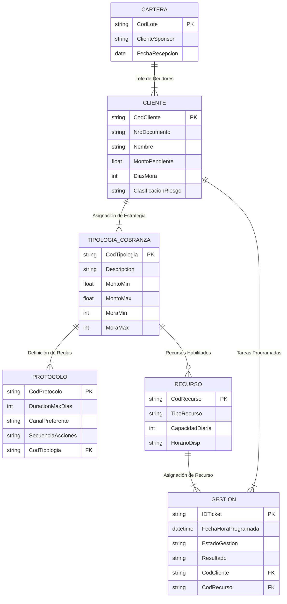

# Módulo: Programación de Recursos de Cobranza (Scheduling)

## 1. Requisitos Funcionales Gerenciales (Definición de Parámetros)

Este módulo es crítico para establecer la política y la tarifa de cobranza, lo cual define los productos (servicios) ofrecidos,. Los parámetros son variables fijas que definen los escenarios posibles y la lógica del negocio.

| Caso de Uso (CU) | Nombre del Requisito Funcional | Detalle de la Función |
| :--- | :--- | :--- |
| **CU 1** | Configurar Tipologías y Parámetros de Servicio de Cobranza | Permitir al Gerente definir los diferentes productos o etapas de cobranza (e.g., Mora Temprana, Prejudicial, Judicial). La definición incluye: Rangos de Mora (días de atraso, e.g., Mora 1 a 10 días), Rangos de Monto (mínimo/máximo de la deuda), y si requiere Garantía o Aval (Codeudor, Hipoteca). |
| **CU 2** | Definir Protocolos y Canales de Gestión | Permitir asociar a cada tipología de cobranza (CU 1) su Protocolo específico de acciones. Esto incluye definir la Duración Máxima de la Campaña (e.g., 10 días), el Tipo y Frecuencia de Canales a utilizar (llamadas automáticas, emails, correos, visitas), y el tipo de Recurso Operativo requerido (operador simple, abogado, robot). |
| **CU 3** | Gestión de Recursos Operativos (Parque) | Registrar y mantener el inventario de recursos reales (operadores, robots de llamada, vehículos). Esto incluye definir la capacidad máxima diaria de cada operador (e.g., 50 llamadas preventivas al día) y los horarios de disponibilidad, ya que estos recursos se asignarán mediante tickets. |

## 2. Requisitos Funcionales de Proceso Masivo (Batch)

Los procesos de cobranza se manejan con grandes volúmenes de deudores, por lo que son típicamente procesos Batch.

| Caso de Uso (CU) | Nombre del Requisito Funcional | Detalle de la Función |
| :--- | :--- | :--- |
| **CU 4** | Recepción y Validación Masiva de Cartera | El sistema debe procesar un archivo de entrada con el lote de deudores (cartera) proporcionado por el cliente (sponsor). El proceso Batch debe validar la integridad y existencia de datos clave (e.g., DNI/RUC contra entidades externas). |
| **CU 5** | Clasificación Automática de Deudores y Asignación de Producto | El sistema, de forma automática, debe clasificar a cada deudor de la cartera (CU 4) y asignarle el producto de cobranza (Preventivo, Judicial, etc.). Esta clasificación se realiza comparando el monto y la mora del deudor contra los parámetros definidos en CU 1. |
| **CU 6** | Generación Masiva de Tickets de Gestión | Basándose en la cartera clasificada (CU 5) y la capacidad del Parque de Recursos (CU 3), el sistema debe generar automáticamente tickets que representan tareas específicas (e.g., "Llamar al deudor X el día Y a la hora Z"). Estos tickets se generan en lote para programar el trabajo futuro de los operadores/robots. |
| **CU 7** | Cambio Automático de Estado por Vencimiento (Gobernanza) | El sistema debe monitorear la duración de las campañas. Si un ticket o gestión de cobranza ha excedido su plazo máximo definido (ej. 10 días), el sistema debe cambiar automáticamente el estado del deudor al siguiente producto o etapa de cobranza (e.g., de Preventivo a Prejudicial), lo cual requerirá la generación de nuevos tickets. |

## 3. Requisitos Funcionales Operacionales (On-Line)

Estos requisitos se refieren a la interacción diaria de los operadores con el sistema y la provisión de información crítica en tiempo real.

| Caso de Uso (CU) | Nombre del Requisito Funcional | Detalle de la Función |
| :--- | :--- | :--- |
| **CU 8** | Consulta de Carga de Trabajo y Disponibilidad | Permitir a los operadores (o al sistema de asignación) consultar en tiempo real los tickets que le han sido asignados. También debe permitir a la gerencia consultar la disponibilidad futura de recursos para responder a nuevos requerimientos del cliente. |
| **CU 9** | Registro de Eventos de Cobranza (Data Entry) | Permitir al operador registrar la interacción con el deudor (llamada, email, visita, etc.), incluyendo el resultado, el compromiso de pago y comentarios en pantalla. Este proceso debe ser ágil, con navegación rápida entre pantallas para maximizar la productividad. |
| **CU 10** | Consulta Crítica de Deuda y Historial | Permitir a los gerentes de cuenta y operadores acceder a una Consulta Crítica de un deudor. Esta vista debe mostrar los datos completos del deudor, el monto adeudado (saldo), la mora actual, el historial de gestión y los compromisos de pago, accediendo a múltiples tablas de forma eficiente. |

---

## 4. Requisitos de Atributos de Calidad (No Funcionales)

Los atributos de calidad definen el comportamiento del sistema y son críticos para un módulo de alto volumen como Cobranzas.

| Atributo de Calidad | Descripción y Criterio Medible |
| :--- | :--- |
| **Rendimiento (Performance)** | 1. **Online (CU 9, CU 10):** Las transacciones críticas (Consulta Crítica, Registro de Gestión) deben ser altamente optimizadas (por ejemplo, mediante la creación de tablas suplementarias o redundancia controlada) para asegurar un tiempo de respuesta mínimo. El tiempo de respuesta aceptable debe ser menor a 2 segundos.<br>2. **Batch (CU 4, CU 6):** Los procesos masivos de actualización de cartera y generación de tickets deben ejecutarse dentro de la ventana de tiempo nocturna asignada (e.g., máximo 3 horas) para no interferir con las operaciones del día siguiente. |
| **Integridad y Seguridad** | El sistema debe garantizar la integridad de los saldos y la coherencia de los datos financieros. El proceso debe evitar la ruptura de Intervalos de Control (IC) o Áreas de Control (AC) en la base de datos para mantener la performance y la estabilidad física de las tablas maestras. El acceso a la información sensible del deudor debe ser restringido y auditado. |
| **Escalabilidad** | El módulo Batch debe estar diseñado para manejar un alto volumen de datos (varios miles o millones de deudores) sin degradar la performance. Debe soportar un crecimiento planificado en la cantidad de registros de movimiento (bitácora de gestión) que son voluminosos. |
| **Usabilidad (Online)** | La navegación entre pantallas del operador (CU 9) debe ser sencilla, idealmente siguiendo flujos de trabajo predeterminados para presentar automáticamente la información necesaria (nombre, teléfono, deuda). |

## 4. Diseño Conceptual del Módulo de Cobranza

### 4.1. Representación Gráfica (Modelo Conceptual – Notación de Chen)

El modelo se centra en la relación crítica entre el cliente deudor, la estrategia de cobranza asignada (Tipología) y el registro detallado de la tarea programada (Ticket/Gestión).




### 4.2. Diccionario de Datos (Fichas de Tipos de Entidad)

#### Entidad: CLIENTE (Deudor)

| Nombre | Descripción | Propósito | Reglas de Negocio Relevantes |
| :--- | :--- | :--- | :--- |
| **CLIENTE** | Representa al deudor cuya cuenta está siendo gestionada por el módulo de cobranza. | Centralizar la información financiera y demográfica relevante para la gestión de la deuda. | **RF 10:** Debe contar con un código único (Cuenta o Código de Cliente). |

| Atributo | Descripción | Propósito | Dominio de Valores | Obligatoriedad | Unicidad | Multivaluado |
| :--- | :--- | :--- | :--- | :--- | :--- | :--- |
| **CodCliente (PK)** | Código único del cliente en el sistema. | Clave principal y enlace a todas las gestiones y movimientos. | Texto (ej. CHAR 10) | Sí | Sí | No |
| **NroDocumento** | Número de identificación (DNI, RUC). | Validación de identidad (CU 4) y búsqueda (Consulta Crítica). | Texto (ej. CHAR 15) | Sí | Sí | No |
| **MontoPendiente** | Saldo total actual que el cliente adeuda. | Determinar la tipología de cobranza aplicable (CU 5) y el riesgo. | Dinero (Decimal 18,2) | Sí | No | No |
| **DiasMora** | Cantidad de días de atraso en el pago (mora actual). | Clave para la reclasificación automática (CU 7) y asignación de Tipología (CU 5). | Número (Entero) | Sí | No | No |
| **ClasificacionRiesgo** | Nivel de riesgo crediticio o de pérdida asociado al cliente. | Apoyo a la toma de decisiones gerenciales. | Enumeración (Bajo, Medio, Alto) | Sí | No | No |

#### Entidad: TIPOLOGIA\_COBRANZA (Producto)

| Nombre | Descripción | Propósito | Reglas de Negocio Relevantes |
| :--- | :--- | :--- | :--- |
| **TIPOLOGIA\_COBRANZA** | Define la estrategia o producto de gestión de deuda, basándose en rangos de monto y mora. | **RF 1, RF 2:** Define los escenarios posibles y la lógica del negocio para la programación (parámetros). | **CU 5:** Un deudor se clasifica automáticamente en una tipología según su mora y monto. |

| Atributo | Descripción | Propósito | Dominio de Valores | Obligatoriedad | Unicidad | Multivaluado |
| :--- | :--- | :--- | :--- | :--- | :--- | :--- |
| **CodTipologia (PK)** | Código único que identifica el tipo de servicio (ej. 'P' para Preventivo). | Clave principal para asociar reglas y recursos a la estrategia. | Texto (ej. CHAR 5) | Sí | Sí | No |
| **Descripcion** | Nombre descriptivo del producto de cobranza. | Visualización en interfaces gerenciales. | Texto | Sí | No | No |
| **MontoMin** | Monto mínimo de deuda para aplicar esta tipología. | Definición de rango (parámetro). | Dinero | Sí | No | No |
| **MoraMax** | Mora máxima (en días) que puede tener un deudor para permanecer en esta tipología. | Disparador para el cambio de estado (CU 7). | Número (Entero) | Sí | No | No |

#### Entidad: RECURSO (Parque Operativo)

| Nombre | Descripción | Propósito | Reglas de Negocio Relevantes |
| :--- | :--- | :--- | :--- |
| **RECURSO** | Entidad que representa la capacidad física y humana disponible para ejecutar las tareas. | **RF 3:** Gestionar el inventario (parque) y la disponibilidad para la generación de tickets. | **CU 6:** La generación de tickets depende de la CapacidadDiaria de cada recurso. |

| Atributo | Descripción | Propósito | Dominio de Valores | Obligatoriedad | Unicidad | Multivaluado |
| :--- | :--- | :--- | :--- | :--- | :--- | :--- |
| **CodRecuro (PK)** | Identificador único del recurso (ej. Operador 001, Robot 005). | Programación de tareas y monitoreo de productividad. | Texto (ej. CHAR 8) | Sí | Sí | No |
| **TipoRecurso** | Rol o naturaleza del recurso asignable. | Clasificación para las reglas de asignación (e.g., solo abogados para Judicial). | Enumeración (Operador, Abogado, Robot, Vehículo) | Sí | No | No |
| **CapacidadDiaria** | Número máximo de tickets o tareas que el recurso puede manejar por día. | Parámetro clave para la Generación Batch de Tickets (CU 6). | Número (Entero) | Sí | No | No |
| **HorarioDisp** | Período de tiempo en que el recurso está disponible para ser programado. | Control de asignación de tareas. | Texto (ej. HH:MM-HH:MM) | Sí | No | No |

#### Entidad: GESTION (Ticket)

| Nombre | Descripción | Propósito | Reglas de Negocio Relevantes |
| :--- | :--- | :--- | :--- |
| **GESTION** | Unidad atómica de trabajo o tarea programada (ticket). | **CU 6, RF 9:** Registrar la asignación de la tarea a un recurso y el evento histórico de la gestión (Data Entry). | **RF 9:** Un ticket debe ser único e identificable con un recurso y un deudor específicos. |

| Atributo | Descripción | Propósito | Dominio de Valores | Obligatoriedad | Unicidad | Multivaluado |
| :--- | :--- | :--- | :--- | :--- | :--- | :--- |
| **IDTicket (PK)** | Identificador único de la tarea de cobranza. | Clave principal para el seguimiento operativo y auditoría. | Texto | Sí | Sí | No |
| **FechaHoraProgramada** | Fecha y hora en la que el recurso debe ejecutar la tarea (programación). | Control del flujo de trabajo de los operadores. | Fecha/Hora | Sí | No | No |
| **EstadoGestion** | Estado actual de la tarea. | Monitoreo operativo (Consulta Crítica). | Enumeración (Pendiente, En Ejecución, Finalizado, Cancelado, Compromiso Pago) | Sí | No | No |
| **Resultado** | Resultado final de la interacción con el deudor (registrado vía Data Entry). | Alimentación del archivo bitácora (Diario de Operaciones). | Texto | No | No | No |
| **CodCliente (FK)** | Referencia al deudor a quien se dirige la gestión. | Enlace a la cuenta (Consulta Crítica). | Texto (CHAR 10) | Sí | No | No |
| **CodRecurso (FK)** | Referencia al recurso asignado para realizar la tarea. | Enlace al operador responsable (Reporte Disputed Items/Collector). | Texto (CHAR 8) | Sí | No | No |

### 4.3. Diccionario de Datos (Fichas de Tipos de Relación)

#### Relación: ASIGNADO\_A

| Nombre | Tipos de Entidad Participantes | Cardinalidades (min..max) | Justificación de Cardinalidades (Reglas de Negocio) |
| :--- | :--- | :--- | :--- |
| **ASIGNADO\_A** | CLIENTE, TIPOLOGIA\_COBRANZA | Cliente (1,1); Tipología (0,N) | **CU 5:** Un cliente debe estar asignado actualmente a una y solo una tipología de cobranza (según sus reglas de monto/mora). Una tipología puede tener cero o muchos clientes asignados en un momento dado. |

#### Relación: ES\_ASIGNADO

| Nombre | Tipos de Entidad Participantes | Cardinalidades (min..max) | Justificación de Cardinalidades (Reglas de Negocio) |
| :--- | :--- | :--- | :--- |
| **ES\_ASIGNADO** | RECURSO, GESTION | Recurso (1,N); Gestión (1,1) | Un ticket (gestión) debe ser asignado a uno y solo un recurso (operario, robot, abogado) para su ejecución. Un recurso puede tener asignadas muchas gestiones. |


---

## 7. Creación de Tablas y Poblamiento de Datos

### 7.1. Creación de Tablas (DDL - Data Definition Language)

* **Forma de Generación:** La generación de las sentencias Data Definition Language (DDL) se realiza de forma Manual, aplicando las reglas de conversión del Modelo Relacional desarrollado en la fase anterior.
* **Lineamientos sobre los Scripts:** Para cumplir con los lineamientos de diseño físico, y asegurar que los scripts puedan reprocesarse, se incluyen sentencias de eliminación (DROP) al inicio.
* Se crea un esquema específico (`prog_cobranza`) para el módulo, y todas las tablas se alojan dentro de este esquema, evitando el esquema `public`.

**Sentencias DDL Consolidadas (Ejemplo General de Estructura):**

```sql
-- 1) Eliminar el esquema si existe (Permite volver a ejecutar) [3]
DROP SCHEMA IF EXISTS prog_cobranza CASCADE; 

-- 2) Crear esquema [2, 3]
CREATE SCHEMA prog_cobranza;

-- Elimina la tabla si existe [3]
DROP TABLE IF EXISTS prog_cobranza.TIPO_COBRANZA CASCADE;

-- 4) Crear tabla [4]
CREATE TABLE prog_cobranza.TIPO_COBRANZA (
    ID_TIPO_COBRANZA CHAR(4) PRIMARY KEY, -- PK
    NOMBRE_TIPO VARCHAR(50) NOT NULL UNIQUE, -- Restricción de unicidad
    MORA_MIN_DIAS NUMERIC(3) NOT NULL,
    MORA_MAX_DIAS NUMERIC(3) NOT NULL,
    MONTO_MIN DECIMAL(14, 2) NOT NULL,
    MONTO_MAX DECIMAL(14, 2),
    REQUIERE_GARANTIA CHAR(1) NOT NULL CHECK (REQUIERE_GARANTIA IN ('S', 'N')), -- Restricción de dominio
    PROTOCOLO_ID CHAR(10) NOT NULL
);

-- Elimina la tabla si existe [3]
DROP TABLE IF EXISTS prog_cobranza.TICKET;

CREATE TABLE prog_cobranza.TICKET (
    ID_TICKET BIGSERIAL PRIMARY KEY, -- PK, usa BIGSERIAL para autoincremento en PostgreSQL
    ID_TIPO_COBRANZA CHAR(4) NOT NULL,
    FECHA DATE NOT NULL,
    HORA_INICIO TIME NOT NULL,
    HORA_FIN TIME NOT NULL,
    ESTADO_TICKET CHAR(1) NOT NULL CHECK (ESTADO_TICKET IN ('D', 'R', 'U')), -- D: Disponible, R: Reservado, U: Usado
    
    -- Claves Foráneas [4]
    CONSTRAINT fk_tipo_cobranza FOREIGN KEY (ID_TIPO_COBRANZA)
        REFERENCES prog_cobranza.TIPO_COBRANZA (ID_TIPO_COBRANZA),
    
    CONSTRAINT fk_fecha_calendario FOREIGN KEY (FECHA)
        REFERENCES prog_cobranza.CALENDARIO (FECHA)
);
```

---
### 7.2. Poblamiento Inicial de Datos (DML - Data Manipulation Language)

* **Datos Utilizados:** Se utilizarán datos sintéticos que reflejen la realidad del negocio, asegurando que los catálogos y las referencias (como tipos de cobranza y recursos) contengan información con coherencia.
* **Orden de Ejecución:** Es crucial asegurar el orden de ejecución de las sentencias `INSERT` para respetar la integridad referencial. Las tablas maestras y de referencia (TIPO\_COBRANZA, RECURSO, CALENDARIO) deben poblarse antes que las tablas transaccionales que las referencian (TICKET, ASIGNACION\_RECURSO\_TICKET).

A continuación, se presentan ejemplos de sentencias `INSERT` para TIPO\_COBRANZA y RECURSO.

#### Ejemplo 1: Poblamiento de TIPO\_COBRANZA

Insertamos dos tipos de cobranza que definen los escenarios del negocio.

```sql
-- Cobranza Preventiva (Menor mora, menor monto)
INSERT INTO prog_cobranza.TIPO_COBRANZA (
    ID_TIPO_COBRANZA, NOMBRE_TIPO, MORA_MIN_DIAS, MORA_MAX_DIAS, 
    MONTO_MIN, MONTO_MAX, REQUIERE_GARANTIA, PROTOCOLO_ID
) VALUES (
    'P001', 'Preventiva Telefónica', 1, 30, 50.00, 1000.00, 'N', 'PROT_P01'
);

-- Cobranza Judicial (Mayor mora, mayor monto, requiere garantía)
INSERT INTO prog_cobranza.TIPO_COBRANZA (
    ID_TIPO_COBRANZA, NOMBRE_TIPO, MORA_MIN_DIAS, MORA_MAX_DIAS, 
    MONTO_MIN, MONTO_MAX, REQUIERE_GARANTIA, PROTOCOLO_ID
) VALUES (
    'J001', 'Judicial Litigio', 91, 365, 5000.00, 9999999.99, 'S', 'PROT_J01'
);


-- Recurso Humano (Operador de Call Center)
INSERT INTO prog_cobranza.RECURSO (
    ID_RECURSO, CODIGO_RECURSO, TIPO_RECURSO, DESCRIPCION, 
    CAPACIDAD_DIARIA, ESTADO
) VALUES (
    1001, 'OPCC_45', 'H', 'Operador Senior Call Center Turno Tarde', 
    60, 'D' -- D: Disponible
);

-- Recurso Tecnológico (Robot para envío masivo de correos)
INSERT INTO prog_cobranza.RECURSO (
    ID_RECURSO, CODIGO_RECURSO, TIPO_RECURSO, DESCRIPCION, 
    CAPACIDAD_DIARIA, ESTADO
) VALUES (
    5001, 'ROB_EMAIL_1', 'T', 'Robot Automatizado Envío Emails', 
    5000, 'M' -- M: Mantenimiento (No disponible para programación)
);
```


### 8.1. Búsqueda de Texto (Índices Invertidos)

#### Escenario Relevante

Se requiere una funcionalidad de búsqueda rápida que permita a los supervisores encontrar recursos (`RECURSO`) o tareas asignadas (`ASIGNACION_RECURSO_TICKET.TAREA_ASIGNADA`) mediante palabras clave específicas (ej., "abogado", "senior", "protocolo judicial") contenidas en campos de texto libre.

#### Fundamentación

Si esta consulta se realiza de manera rutinaria utilizando comandos estándar como `LIKE '%palabra%'` sobre un campo extenso (`VARCHAR`), el sistema se vería obligado a barrer (scan) toda la tabla. Dado que esta consulta podría ser muy solicitada (alta demanda) y su costo es alto (barrido completo), se clasifica como una consulta crítica. Este tipo de búsqueda consume mucho tiempo, lo que degrada la performance del sistema.

La solución técnica para búsquedas de texto es el uso de Listas Invertidas (Índices Invertidos).  Esta técnica permite la búsqueda por palabras (tipo Google) y resuelve la consulta previamente, minimizando el tiempo de respuesta.

#### Diseño de la Solución e Integración

La solución consiste en crear un índice invertido (Full Text Search Index en PostgreSQL) sobre la columna `DESCRIPCION` en la tabla `prog_cobranza.RECURSO`. Este índice transformará el texto en tokens (palabras clave) que pueden ser consultados de forma rápida.

**Sentencias SQL (Ejemplo Conceptual):**

```sql
-- DDL: Creación de la columna y el índice invertido (asumiendo PostgreSQL)
ALTER TABLE prog_cobranza.RECURSO
    ADD COLUMN TS_DESCRIPCION TSVECTOR;

-- Actualización del índice (generalmente en Batch)
UPDATE prog_cobranza.RECURSO
    SET TS_DESCRIPCION = TO_TSVECTOR('spanish', DESCRIPCION);

-- Creación del Índice GIN (implementación de Listas Invertidas)
CREATE INDEX idx_recurso_descripcion_ts
    ON prog_cobranza.RECURSO USING GIN (TS_DESCRIPCION);

-- DML: Ejemplo de uso del Índice Invertido (Búsqueda por palabras)
SELECT ID_RECURSO, DESCRIPCION
FROM prog_cobranza.RECURSO
WHERE TS_DESCRIPCION @@ TO_TSQUERY('spanish', 'Operador & Senior');
```

### 8.2. Manejo de Grandes Volúmenes de Datos (Particionamiento)

#### Escenario Relevante

La tabla `ASIGNACION_RECURSO_TICKET` (T5), que registra cada tarea específica asignada a un recurso, se proyecta con un volumen superior a 10 millones de registros en 3 años. La mayoría de las consultas operativas y gerenciales (ej. performance diaria o auditoría del último trimestre) solo acceden a los datos más recientes.

#### Fundamentación

El alto volumen de datos en T5 afecta directamente el rendimiento de las consultas. Para evitar que las consultas lentas "atrasen" el sistema, se debe aplicar una estrategia de Particionamiento. El particionamiento divide la data en partes más pequeñas (segmentos físicos) por rangos de clave. 

#### Diseño de la Estrategia de Particionamiento

Se seleccionará la columna `FECHA` (que se deriva del `ID_TICKET` asociado) como clave de particionamiento, ya que las consultas se dan generalmente por periodo de tiempo (recurrencia).

* **Tabla seleccionada:** `prog_cobranza.ASIGNACION_RECURSO_TICKET` (T5).
* **Campo de particionamiento:** `FECHA`.
* **Criterio:** Particionamiento por Rango (mensual o trimestral), ya que el tiempo es continuo y predecible. Particionar por meses es adecuado para reportes de gestión que suelen ser mensuales.

**Sentencias SQL (Ejemplo Conceptual de Particionamiento Mensual):**

```sql
-- DDL: Creación de la tabla maestra particionada (ejemplo de PostgreSQL 11+)
CREATE TABLE prog_cobranza.ASIGNACION_RECURSO_TICKET (
    ID_TICKET NUMERIC(15) NOT NULL,
    ID_RECURSO NUMERIC(10) NOT NULL,
    FECHA DATE NOT NULL,
    -- ... otros atributos
    PRIMARY KEY (ID_TICKET, ID_RECURSO, FECHA)
) PARTITION BY RANGE (FECHA);

-- DDL: Creación de particiones hijas (ejemplo para un mes)
CREATE TABLE prog_cobranza.ASIGNACION_RECURSO_TICKET_202401
    PARTITION OF prog_cobranza.ASIGNACION_RECURSO_TICKET
    FOR VALUES FROM ('2024-01-01') TO ('2024-02-01');

-- DML: Ejemplo de consulta que accede solo a una partición
SELECT *
FROM prog_cobranza.ASIGNACION_RECURSO_TICKET
WHERE FECHA >= '2024-03-01' AND FECHA < '2024-04-01'; 
-- El gestor solo revisa la partición de marzo, ignorando los millones de registros anteriores.
```

### 8.3. Actualización Periódica de Datos (Procesos Batch)

#### Escenario Relevante

La generación de nuevos tickets (cupos) disponibles para la venta o asignación requiere evaluar masivamente la capacidad diaria de todos los recursos (T2) y la disponibilidad del calendario (T3). Asimismo, la clasificación de deudores o la liquidación de las tareas completadas deben realizarse al final del día.

#### Fundamentación

La Actualización de Base de Datos a grandes volúmenes (como la generación de millones de tickets disponibles) o el Recálculo de Indicadores (estadísticas, saldos) son procesos Batch.  Ejecutar estas operaciones en línea (*On-Line*) paralizaría el sistema por el alto consumo de recursos, por lo que deben ser ejecutadas de manera nocturna o periódica. Estos procesos se resuelven de manera óptima utilizando la técnica de Matching, que requiere que los archivos de entrada estén secuenciales y ordenados por clave.

#### Diseño del Flujo de Ejecución (Generación de Tickets)

El proceso Batch debe ser re-ejecutable y utilizar un esquema de cuadre de totales (Checkpoint) para asegurar la integridad de la información generada.

**Flujo de Ejecución (Pasos):**

| Paso | Módulo (Función) | Entrada | Proceso | Salida |
| :--- | :--- | :--- | :--- | :--- |
| P1 | ORDENA-DATOS | RECURSO (Tabla), CALENDARIO (Tabla) | Descarga y Ordenamiento secuencial de Recursos y Días operativos. | FICHERO\_RECURSO\_SEQ, FICHERO\_CALENDARIO\_SEQ (Archivos Planos). |
| P2 | PROGRAMA (Match) | FICHERO\_RECURSO\_SEQ, FICHERO\_CALENDARIO\_SEQ | Cruza (Match) la capacidad de los recursos con los días disponibles para generar los cupos (TICKET temporal). | FICHERO\_TICKET\_NEW (Archivo Plano de Movimiento). |
| P3 | CARGA-BD | FICHERO\_TICKET\_NEW | Carga Masiva (LOAD o COPY) de los nuevos tickets a la tabla TICKET (T4). | prog\_cobranza.TICKET (Tabla Indexada). |
| P4 | CUADRE-CONTROL | FICHERO\_TICKET\_NEW, prog\_cobranza.TICKET | Verifica que el total de tickets generados en P2 sea igual al total de registros insertados en P3. | LOG |

**Sentencias SQL (Ejemplo de Cuadre de Control)**

La verificación de totales es una práctica indispensable para garantizar la confiabilidad del sistema.

```sql
-- Verificar que los totales del proceso (FICHERO_TICKET_NEW) 
-- coincidan con la carga final en la tabla TICKET (T4).

-- 1. Obtener el total de registros cargados en el proceso Batch (asumido por variable)
SELECT COUNT(*) INTO total_cargado FROM prog_cobranza.TICKET WHERE FECHA = CURRENT_DATE;

-- 2. Obtener el total de tickets que debieron generarse según la capacidad diaria total (asumido por variable)
SELECT SUM(CAPACIDAD_DIARIA) INTO capacidad_total_esperada FROM prog_cobranza.RECURSO WHERE ESTADO = 'D';

-- 3. Comparación y alerta si hay descuadre
IF total_cargado != capacidad_total_esperada THEN
    RAISE EXCEPTION 'ERROR DE CUADRE: La cantidad de tickets cargados (%) no coincide con la capacidad total esperada (%).', 
        total_cargado, capacidad_total_esperada;
END IF;
```

